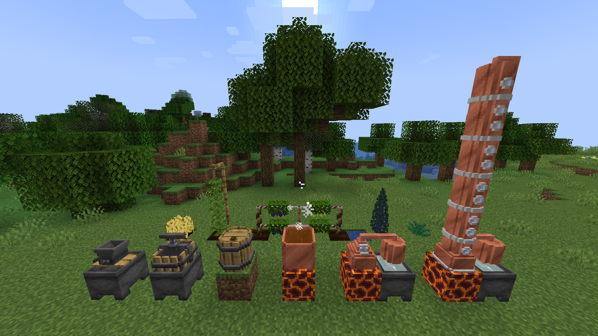
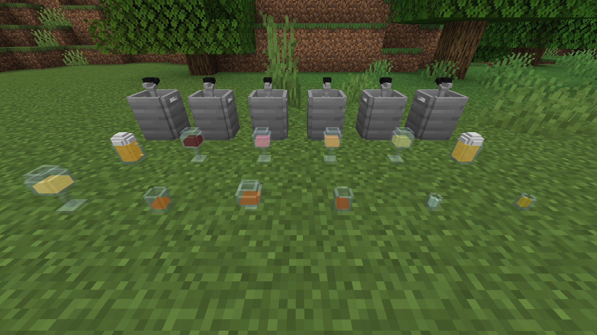
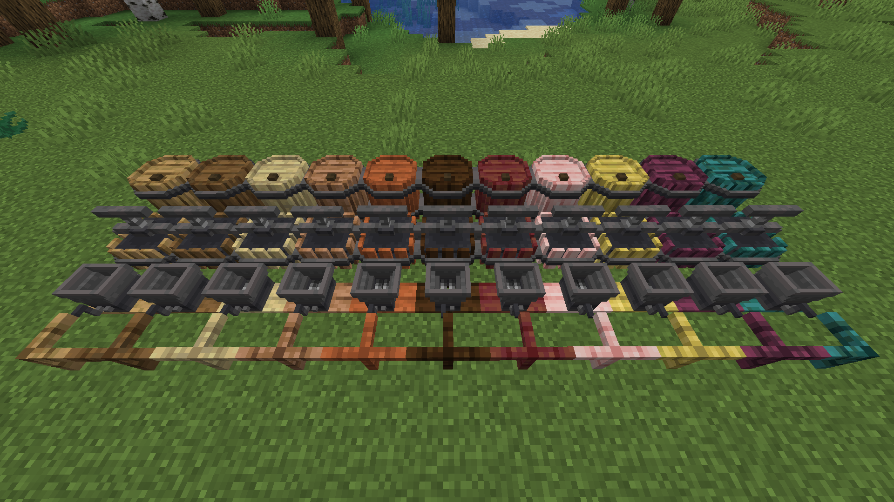
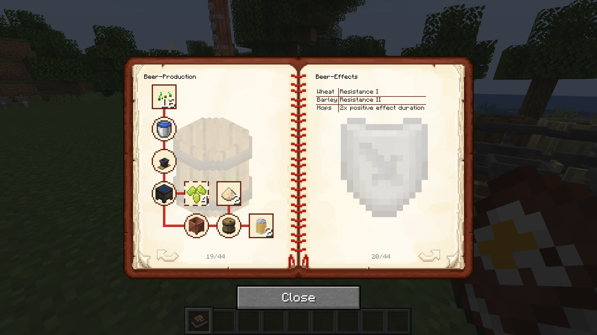

## AI disclosure

About 80% of the code is AI generated, everything else (models, textures, text, etc.) is made by me. This project is mainly a learning experience so I am slowly transitioning to writing most of the code myself as I learn.

## Requirements

Geckolib 4.7+

## Description

Tadacko's Drinks is a Forge mod mainly focusing on semi-realistic implementation of alcoholic beverage production processes and the effects of alcohol. The drinks also have beneficial secondary effects (can be turned off in the config). Many features in this mod can be customized in the config (WIP). If you don't want to deal with config files you can use a mod like Configured or Forge Config Screens to access the config from the in-game GUI.

## Features

All processes, recipes and effects documented in the form of an in-game Guide Book. All drinks apply an Inebriation effect, its intensity and duration determined by the player's blood alcohol content. BAC is calculated via Widmark's formula using the ABV and volume of the drink, body weight and alcohol distribution ratio of the player's character (each player can set their own in the config if allowed by server) and alcohol elimination rate (set to 10x real rate by default).

Drink types and their secondary effects:

- Beer - Resistance I-II
- Wine - Health Boost/Absorption I-II
- Cider - Haste I-II
- Mead - Wisdom I-II (XP multiplier)
- Whisky - Erudition I-II (adds treasure enchantments to enchanting table)
- Brandy - Improved Digestion I-II (decreased hunger drain, no sprint penalty)
- Rum - Piracy I-II (makes mobs drop treasure)
- Vodka - Charisma I-II (villager discount)
- Gin - Savagery I-II (increased critical damage)
- Tequila - increases duration of applied effects

Equipment:

- Ingredient pre-processing: Manual Crusher, Manual Press, Copper Pot
- Fermentation: Fermenting Barrel
- Distillation: Pot Still, Column Still
- Fluid transportation and storage: Keg

Crops: Barley, Hops, Grapes, Juniper, Agave

## Screenshots

